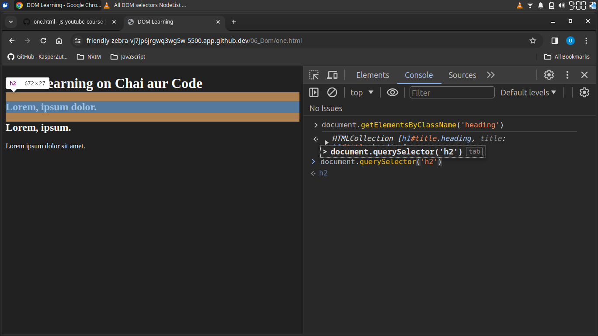
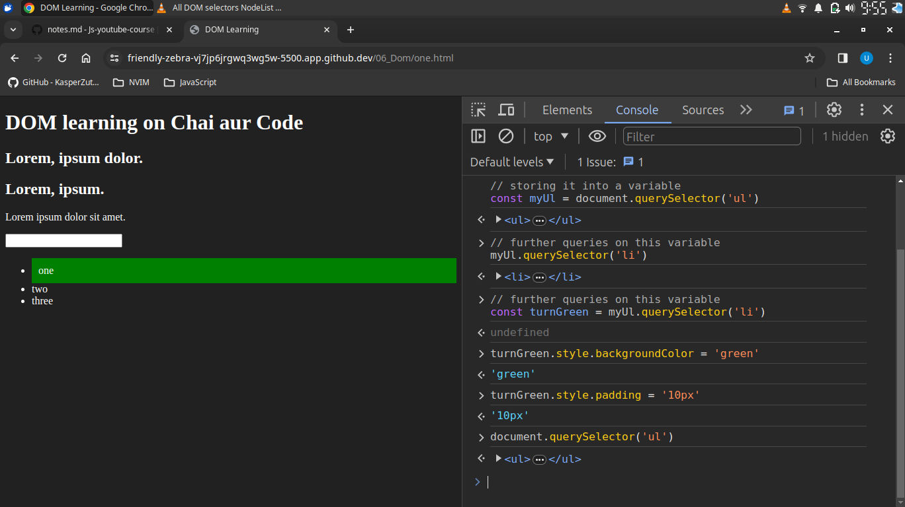
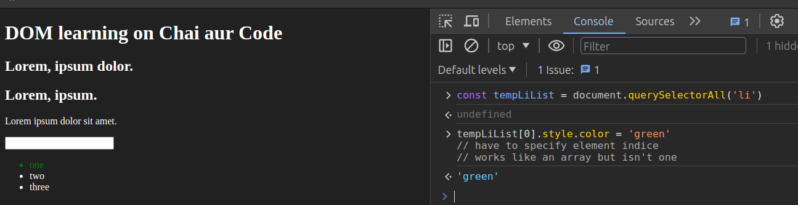
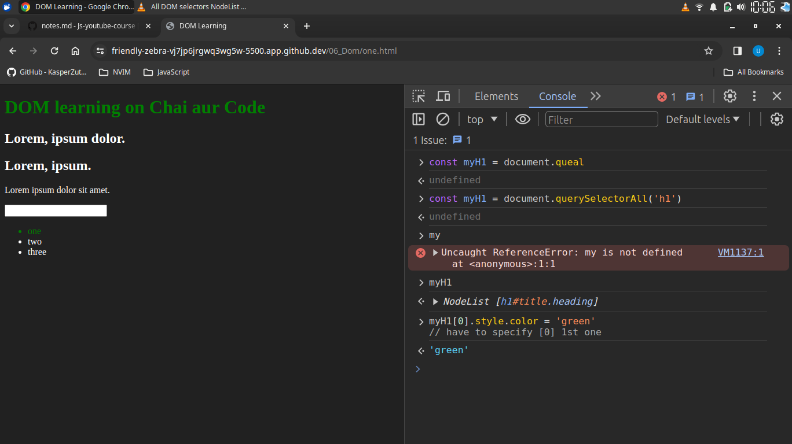
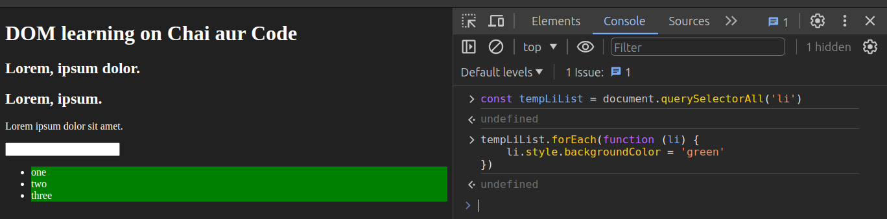
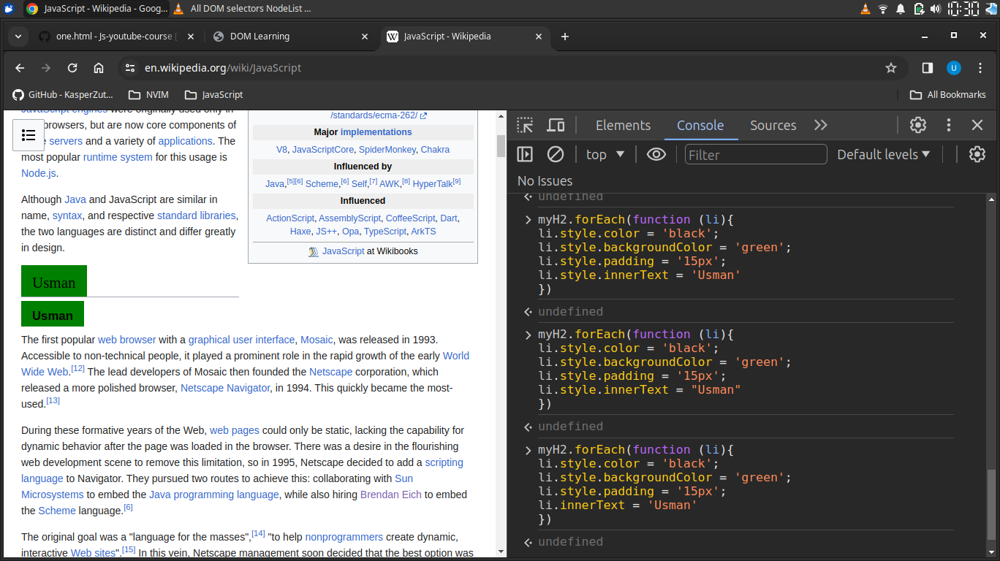

# Query selectors

s
---
## querySelector
```js
document.querySelector('h1')
```
selects 1st `h1` from the web page


can select ***ID*** and *class* following way 
```js
document.querySelector('#title') 
//selecting heading 
``` 
can select ***class*** following way 

```js
document.querySelector('.heading') 
//selecting class
``` 
```js
document.querySelector('input[type="password"]') 
//selecting input field
``` 


---
## QuerySelectorAll()







tinjering on wikipedia


